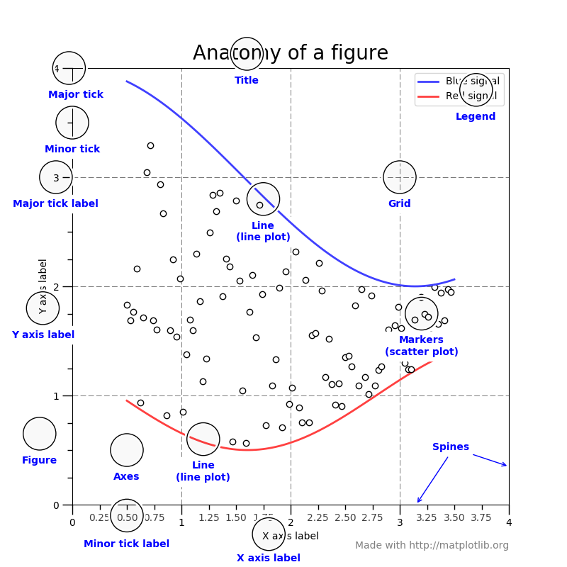

# 基础知识

## 导入

```python
import matplotlib.pyplot as plt

plt.rcParams['font.sans-serif']=['SimHei']  # 用来正常显示中文标签
plt.rcParams['axes.unicode_minus']=False    # 用来正常显示负号
```

## Coding Style

plt中有所谓的"current figure"和"current axes"，使用模块级别的函数时，就是操作当前对象。这种方法与MATLAB的绘图一致，被称为MATLAB style

```python
plt.plot([1, 2, 3])
plt.title('example')
plt.show()
```

当然，也可以先显式创建figure和axes，然后对它们进行操作，称作Object Oriented style

```python
fig, ax = plt.subplots()
ax.plot([1, 2, 3])
ax.set_title('example')
plt.show()
```

两种方法相比，显然Object Oriented style更好官方文档建议使用面向对象方法绘图

## 示例

```python
import numpy as np
import matplotlib.pyplot as plt

# 初始化Figure和Axes
fig, ax = plt.subplots(1, 2)    # ax是Array[Axes]

# 绘图
x = np.linspace(0, 1)
y = np.exp(x)
line = ax.plot(x, y, label='line')
scatter = ax.scatter(x**2, y)

# 设置标题，标签
ax1.set_title('axes 1')   # 每个Axes有自己的标题，figure还有一个大标题
fig.suptitle('example')   # figure标题
ax1.set_xlabel('x')
ax1.set_ylabel('$e^x$')   # 使用latex

# 其他
ax1.grid(linestyle='--', color='gray')  # 网格
ax1.legend(loc='lower right')  # 绘制标签，即绘图时的label参数
plt.tight_layout()  # 自动调整排版

# 显示图片
plt.show()

# 保存图片（不能先显示再保存，会出问题。但可以先保存再显示）
fig.savefig('fig.png', dpi=192, transparent=True, format='png')

# 关闭图片并释放内存
fig.close()
```

# 图片元素



* **Figure**

Figure包含了图像的所有元素，包括Axes，少数特殊的Artists，以及Canvas（注意用户一般不会直接绘制Canavs，而是通过其他对象来操作Canvas）

* **Axes**

Axes是主要的图像内容，包含了数据图线等元素。一个Figure中可以包含若干个Axes，一个Axes只能属于一个Figure。大部分其他图像元素都包含于Axes，如Axis（二维图2个，三维图则3个），label，title等

* **Axis**

注意：英语中Axis是Axes的单数形式，但Axis和Axes是完全不同的两种对象

Axis是图像的轴，负责图像取值范围（可以用`axes.set_xlim`的方法从Axis所属Axes设置），刻度（tick，刻度位置由Locator对象决定）和刻度标签（ticklabel，刻度标签格式由Formatter对象确定）

* **Artist**

Artist包括了几乎所有图像元素。Figure, Axes, Axis都是Artist的子类，但多数Artist都被绑定至Axes对象，而不能被多个Axes共享。绘制图像时，所有Artist被画到Canvas上

## figure与axes

```python
from matplotlib import pyplot as plt
from matplotlib.gridspec import GridSpec

# 基本的初始化。产生一副高8英寸、宽4英寸，有2行2列子图的图
fig, ax = plt.subplots(figsize=(8, 4), ncols=2, nrows=2, tight_layout=True)
ax[0, 0]    # 左上角的子图
ax[1, 0]    # 左下角的子图

# 另一种常用写法
fig, (ax1, ax2) = plt.subplots(ncols=2)

# 复杂的子图排布
# ╓═══════════╖
# ║    ax0    ║
# ╟═════╥═════╢
# ║ ax1 ║ ax2 ║
# ╙═════╨═════╜
fig = plt.figure(figsize=(8, 4), tight_layout=True)
gs = GridSpec(2, 2)
ax0 = fig.add_subplot(gs[0, :])
ax1 = fig.add_subplot(gs[1, 0])
ax2 = fig.aadd_subplot(gs[1, 2])
```

## 坐标轴、边框与刻度

坐标轴（Axis）和边框（Spines）都从属于Axes

```python
from matplotlib import pyplot as plt

fig, ax = plt.subplots()

# 边框颜色
color = '#dddddd'
ax.spines['bottom'].set_color(color)
ax.tick_params(axis='both', colors=color)
ax.xaxis.label.set_color(color)  # y轴设置略去

# 设置坐标轴刻度
ax1.set_xscale('log')  # 坐标系选取
ax1.set_xlim(0, 1)     # 坐标范围。可以用get_xlim获取
ax1.tick_params('x', which='both', left=False) # tick样式
ax1.set_xticks(np.linspace(0, 1, 5))           # tick位置
ax1.set_xticklabels([*'12345'])                # tick标签

# 另一种设置tick的方式
xt = ax1.get_xticks()
xtl = ax1.get_xticklabels()
# edit xt and xtl
ax1.set_xticks(xt)
ax1.set_xticklabels(xtl)

# 关闭坐标轴和坐标刻度
ax.axis('off')
ax.set_xticklabels([])
ax.set_yticklabels([])

# 去掉右上边框并调整坐标轴位置
ax.spines['top'].set_visible(False)
ax.spines['right'].set_visible(False)
ax.xaxis.set_position('bottom')
ax.spines['bottom'].set_position('zero')
ax.yaxis.set_position('left')
ax.spines['left'].set_position(('data', 0))  # 'zero'和('data', 0)两种写法效果相同
```

# 基本绘图

## 折线图

```python
import matplotlib.pyplot as plt
import numpy as np

fig, ax = plt.subplots()

# make data
x = np.linspace(0, 10)
y = np.sin(x)

# plot
lines = ax.plot(x, y, '--m')  # 线条格式，-直线，--虚线，-.点划线，.o+s^不同形状的点，rgbcmyk颜色

# change line format
line = lines[0]
line.set_linewidth(5)

plt.show()
```

## 条形图

```python
from matplotlib import pyplot as plt
import numpy as np
from itertools import chain

fig, ax = plt.subplots()

# make data
x = np.arange(10)
group1 = np.random.randint(10, 20, size=10)
group2 = np.random.randint(15, 25, size=10)

# plot
rects1 = ax.bar(x-0.2, group1, width=0.4)
rects2 = ax.bar(x+0.2, group2, width=0.4)

# 在每个条形上面标注数字
for rect in chain(rects1, rects2):
    center = rect.get_x() + rect.get_width()/2
    height = rect.get_height()
    ax.text(center, height+1, f'{height:.1f}', ha='center', va='bottom')

plt.show()
```

## 直方图

```python
from matplotlib import pyplot as plt
import numpy as np

fig, ax = plt.subplots()

# make data
data = np.random.normal(size=1000)
mu, sigma = np.mean(data), np.std(data)

# plot
ax.hist(data, bins=10, edgecolor='white')

ax.set_xlim(mu-5*sigma, mu+5*sigma) # 实践显示这个范围画出来的图比较好看
plt.show()
```

## 误差杆

```python
from matplotlib import pyplot as plt
import numpy as np

fig, axs = plt.subplots(nrows=2)

# make data
N = 14
x = np.arange(1, N+1)
y = np.arange(0, N)
x_err = 0.1*np.sqrt(x)
y_err = np.sqrt((x-1)*(N-x)/(N-1))

# 对称误差杆
ax = axs[0]
ax.errorbar(x, y, xerr=x_err, yerr=y_err, fmt='o', capsize=2)

# 不对称误差杆
ax = axs[1]
ax.errorbar(x, y, xerr=[x_err, x_err*0.3], yerr=[y_err/2, y_err], fmt='--o')

plt.show()
```

## 区域填充

```python
from matplotlib import pyplot as plt
import numpy as np

fig, ax = plt.subplots()

# make data
x = np.linspace(0, 1)
y1 = x
y2 = x ** 2

# plot
ax.fill_between(x, y1, y2, alpha=0.6)

plt.show()
```

# 文字与箭头

```python
from matplotlib import pyplot as plt

fig, ax = plt.subplots()
ax.plot([0, 10], [0, 10])

# 绘制文字。title、xlabel之类的其实都是用装饰器包装起来的text
ax.text(5, 2, 'example text on point (1, 5)', ha='center', va='bottom')

# 绘制文字以及箭头。也可以留空文字仅绘制箭头
text_pos, point_at = (2, 7), (4, 4)
ax.annotate('example text with line', point_at, text_pos, arrowprops={'arrowstyle':'->'})
```

# 其他

## 动态图

`FuncAnimation(fig, func, frames=None, init_func=None, fargs=None, save_count=None, *, cache_frame_data=True, **kwargs)`

* func : `func(frame, *fargs) -> Iterable[artist]`，回调函数，绘制每一帧
* frames：`Union[Iterable[object], int, None]`，迭代结果作为参数被传给func，使用int时相当于range，使用None相当于itertools.count
* fargs：调用func的额外参数
* interval：number，两帧之间的间隔时间，单位毫秒，默认200
* blit：bool，当`blit = True`时，只有被func返回的Artist才被重新绘制；否则全部重绘，无视func返回值

```python
import numpy as np
import matplotlib.pyplot as plt
from matplotlib.animation import FuncAnimation

def update(phase, line):
    y = line.get_ydata()
    line.set_ydata(np.roll(y, -5))
    return [line]

fig, ax = plt.subplots()
x = np.linspace(0, 2*np.pi, 100, endpoint=False)
line = ax.plot(x, np.sin(x))
anim = FuncAnimation(fig, func=update, frames=np.linspace(0, 2*np.pi, 100),
        fargs=line, blit=True) 
# 注意！一定要将animation赋给一个变量，否则会被gc
plt.show()
return 0
```

## 3D图

使用3D Axes绘制

**surface plot**

`Axes3D.plot_surface(self, X, Y, Z, *args, norm=None, vmin=None, vmax=None, lightsource=None, **kwargs)`

```python
import matplotlib.pyplot as plt
import numpy as np

# X, Y, Z是相同shape的二维数组
X, Y = np.meshgrid(np.linspace(-5, 5), np.linspace(-5, 5))
R = np.sqrt(X**2 + Y**2)
Z = np.sin(R)

fig = plt.figure()
ax = fig.add_subplot(projection='3d')
ax.plot_surface(X, Y, Z)
```

**colorbar**

```python
from matplotlib import cm

surf = ax.plot_surface(X, Y, Z, cmap=cm.coolwarm)
# Add a color bar which maps values to colors.
fig.colorbar(surf, shrink=0.5, aspect=5)
```

## Colormap

```python
import numpy as np
from matplotlib import pyplot as plt
from matplotlib import colors

fig, ax = plt.subplots(2)

# Make data
X, Y = np.meshgrid(np.linspace(-5, 5), np.linspace(-5, 5))
R = np.sqrt(X**2 + Y**2)
Z1 = np.sin(R)
Z2 = np.exp(-(X)**2 - (Y)**2)

# Simple colormap (with colorbar)
pcm = ax[0].pcolormesh(X, Y, Z1, cmap='inferno')
fig.colorbar(pcm, ax=ax[0])

# Logarithm colorbar
pcm = ax[1].pcolormesh(X, Y, Z2, cmap='Purples',
                       norm=colors.LogNorm(vmin=Z2.min(), vmax=Z2.max()))
fig.colorbar(pcm, ax=ax[1])

plt.show()
```

## 局部放大

```python
from matplotlib import pyplot as plt

fig, ax = plt.subplots()
axins = ax.inset_axes([0.6, 0.6, 0.37, 0.37])  # 四个参数是左下角坐标以及宽高。单位是ax的宽高

# Make data
X, Y = np.meshgrid(np.linspace(-5, 5), np.linspace(-5, 5))
R = np.sqrt(X**2 + Y**2)
Z = np.sin(R)

# Plot same things to ax & axins
ax.imshow(Z, cmap='Purples')
axins.imshow(Z, cmap='Purples')

# Zoom in
x1, x2, y1, y2 = -0.5, 0.5, -0.5, 0.5
ax.indicate_inset_zoom(axins)

plt.show()
```
