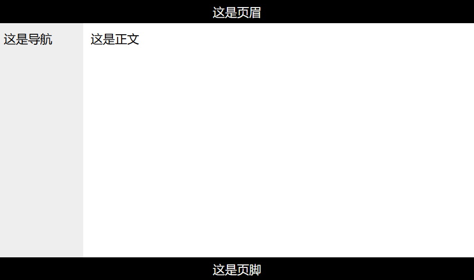

# HTML，CSS与JS

HTML定义了网页的内容，CSS 描述了网页的布局，JavaScript描述网页的行为

原则上来说三个都可以塞进html页面里，但这就很难开发了，所以更常见的做法是三者分开，在html里面调CSS和JS

# HTML

HTML(超文本标记语言，Hyper-Text Markup Language)是用于创建网页的标准标记语言

HTML元素以起始标签（如```<p>```）起始，终止标签（如```</p>```）结束，起止标签中间的内容就是元素的内容，标签可以没有内容，甚至可以在起始的同时终止（比如，换行标签`<br />`。一些不规范写法将其写成`<br>`，可能会被当作缺少终止标签）

不同种类的标签定义了不同的网页元素（如，标题`<title>`，段落`<p>`，etc.）。标签常具有属性，属性可能规定了其样式，也可能是用于区分不同标签的，比如``具有src和width两个属性

## 基础

```html
<!DOCTYPE html>   <!-- 声明是html5文档。标签对大小写不敏感，在将来版本会强制用小写标签 -->
<html>            <!-- 根元素 -->
    <head>            <!-- 包含元数据 -->
        <title>文档标题</title>
        <meta charset="utf-8">
        <base href="//www.runoob.com/images/" target="_blank">     <!-- 默认链接 -->
        <link rel="stylesheet" type="text/css" href="mystyle.css"> <!-- 外部样式 -->
    </head>

    <body>            <!-- body包含了可见的内容 -->

        <h1>一级标题</h1>
        <p>段落</p>
        <a href="http://www.google.com">超文本链接</a>
        
            <!-- 宽度为页面的100%，高度30像素。会自动拉伸图片，如果宽高只指定一个就能保持宽高比 -->
        <br>  <!-- 换行。源代码中的连续空白、空行都会被当作一个空格 -->
        <hr>  <!-- 分割线 -->

        <p>字体
            <b>粗体(bold)</b>
            <i>斜体(italic)</i>
            <strong>加重，通常也被渲染为粗体</strong>
            <em>着重，常被渲染称斜体</em>
            <sub>下标</sub>
            <sup>上标</sup>
            <del>删除线</del>
        </p>
        
        <p style="color:blue;margin-left:20px;">
            内联样式。常用样式：
            background-color   背景颜色
            font-family        字体
            color              文字颜色
            font-size          文字尺寸，如20px
            text-align         对齐方式，如center
            在旧版本，有font, center, strike标签，color, bgcolor属性用来实现样式
            现在建议只使用style
        </p>
        
        <!-- 图像 -->
        
        
        <!-- 表格 -->
        <table width="500" border="1" cellpadding="10">
            <caption>标题</caption>
            <tr>
                <th colspan="2">Header 1</th>
                <!-- th表示表头，colspan表示跨列（即一个占两列），rowspan表跨行-->
            </tr>
            <tr>
                <td>row 1, cell 1</td>
                <td>row 1, cell 2</td>
            </tr>
            <tr>
                <td>row 2, cell 1</td>
                <td>row 2, cell 2</td>
            </tr>
        </table>
        
        <li>无序列表</li>
        <ol>
            <li>li套在ol里为有序列表</li>
        </ol>
        
        <div>
            块级元素，经常当作容器
        </div>
  </body>
</html>
```

## 布局

以CSS定位div元素布局为例

```html
<!DOCTYPE html>
<html>
    <head>
        <title> example </title>
        <meta charset="utf-8">
        <link rel="stylesheet" href="style.css">
    </head>

    <body>
        <div id="header">这是页眉</div>
        <div id="nav">这是导航</div>
        <div id="section">这是正文</div>
        <div id="footer">这是页脚</div>
    </body>
</html>
```

```css
#header {
    background-color:black;
    color:white;
    text-align:center;
    padding:5px;
}
#nav {
    line-height:30px;
    background-color:#eeeeee;
    height:300px;
    width:100px;
    float:left;
    padding:5px; 
}
#section {
    width:350px;
    float:left;
    padding:10px; 
}
#footer {
    background-color:black;
    color:white;
    clear:both;
    text-align:center;
    padding:5px; 
}
```

效果如下：



## 实体引用

实体引用（Character Entity Reference）相当于HTML的转义字符，格式是`&entity_name;`

| 实体引用        | 显示的字符        |
| --------------- | ----------------- |
| `&lt; &gt;`     | `< >`             |
| `&amp;`         | `&`               |
| `&apos; &quot;` | `' "`             |
| `&#25105;`      | 我（unicode字符） |

# XML

XML（EXtensible Markup Language）是类似HTML的标记语言，但注重传输数据而非显示数据。XML没有预定义标签，标签名对大小写敏感，允许嵌套标签（但必须是严格的嵌套），每个XML文档有且仅有一个根元素

## XML命名空间(XML Namespaces)

<前缀:标签名 xmlns:前缀="命名空间">
<root xmlns:前缀="命名空间">（在根元素中声明）
一个命名空间被定义后，拥有相同前缀的元素都与该空间相关联
命名空间通常使用对应的url

## XHTML

XHTML是结合了XML和HTML的一种标记语言
语法规则大体与XML相同，功能大体与HTML4相同

# CSS

CSS指层叠样式表（**C**ascading **S**tyle **S**heets），它定义了HTML样式，存储于可层叠的表中

```css
/* 选择器，作用于所有<p>标签 */
p
{
    color:red;
    text-align:center;
}

/* id选择器，作用于有这个id的html标签，例如：<div id="para1"> */
#para1 {text-align:center; color:red;}

/* class选择器，作用于所有class="center"的html标签 */
.center {text-align:center;}
```

## 使用样式表

```html
<head>
    <!-- 外部样式表 external style sheet -->
    <link rel="stylesheet" type="text/css" href="mystyle.css">
    
    <!-- 内部样式表 internal style sheet -->
    <style>
        hr {color:sienna;}
        p {margin-left:20px;}
        body {background-image:url("images/back40.gif");}
    </style>
</head>

<body>
    <!-- 内联样式 inline style。会导致内容和样式混杂、样式无法复用 -->
    <p style="color:sienna;margin-left:20px">这是一个段落。</p>
</body>
```

当样式重复定义时，冲突属性取最后定义的

# JavaScript

## JS代码块

一般在head中或者body的底部定义script，在有需要的时候调用。代码在网页加载时会被运行一次

```html
<head>
    <!-- 使用外部脚本 -->
    <script src="myScript.js"></script>

    <!-- 在head中写脚本 -->
    <script>
        function func() {document.getElementById("demo").innerHTML="Hello World!";}
    </script>
</head>

<body>
    <!-- 在body底部写脚本 -->
    <script>
        function funcInBody() {\*do something*\}
    </script>
</body>
```

## 事件

事件是用户的某种动作，比如鼠标点击、按键、调整页面大小等。一般在通过侦听代码监听事件、依据发生的事件调用函数

* 事件处理器属性

将html标签的事件处理器属性设置为js函数，当事件发生时就会调用函数

```html
<button onclick="func()"> 调用函数 </button>
```

当然，这个onclick属性不该写死在html里面，它应该通过js动态赋值。将页面内容与网页行为分离能大大降低开发和维护的难度

```javascript
// 定义事件处理函数
bgChange(event) {
  const rndCol = 'rgb(' + random(255) + ',' + random(255) + ',' + random(255) + ')';
  e.target.style.backgroundColor = rndCol;
}

// 只有一个标签
const btn = document.querySelector('button');
btn.onclick = bgChange

// 给多个标签绑定相同函数
const buttons = document.querySelectorAll('button');
for (let i = 0; i < buttons.length; i++) {
  buttons[i].onclick = bgChange;
}
```

* EventListener

相比于事件处理器属性，事件监听器允许给一个事件绑定多个行为，还能很方便地动态管理这些行为

```javascript
const btn = document.querySelector('button');
btn.addEventListener('click', bgChange);
btn.removeEventListener('click', bgChange);
```

## 数据类型与变量

```javascript
// 基本类型
var x;      // undefined
x = 1.5;    // number
x = 'Joe';  // string，单引号或者双引号均可
x = true;   // boolean
x = null;   // 值为null，类型不变
x = undefined;
            // 值和类型都不定，null == undefined，但null !== undefined

// 字符串
var str = 'some string';
str.length;
str.search('/regular expression/i')
    // 返回子串起始位置
    // js中的正则表达式：/表达式内容/[修饰]
    // 一些常用修饰：i不区分大小写，g全局匹配，m多行匹配
str.replace('pattern', 'repl')

// RegExp对象
var pattern = /regexp/
pattern.test('string')
    // 测试string是否匹配pattern模式，返回boolean

// 引用类型
var arr = new Array();  // JS数组和python列表差不多
var arr2 = [1, 4];
var person = {name:"John", age:14};
    // object，可以用person["name"]或person.name来引用

// typeof
typeof x;   // 返回x的类型

// 强制类型转换，以String为例，Number也类似
String(x);
x.toString();
```

### 变量提升

JavaScript允许先定义后声明，这种情况下，声明语句会被自动提升到定义前。但是在声明同时初始化的变量不会被提升，还有一些其他的复杂规则。因此还是得好好的先声明再使用

或者使用```"use strict"```指令，在ECMAScript5及之后版本中，此指令声明严格模式，不允许先定义再声明，同时禁止了一些不太安全的操作

## 运算符

算数运算符（+-*/%)，赋值运算符（=, +=, -=, *=, /=, %=），自增自减（++, --），条件（? :），比较（>, <, ==, >=, <=, !=）

大部分和C一致，以下列出不一样的地方

```javascript
'a' + 5    // = 'a5'，字符串间、字符串与数字间可以做加法

a === b;   //绝对等于，值和类型均相等
a !== b;   //不绝对等于，值或类型不相等
```

## 语句

```javascript
//条件执行
//if ... else if ... else，同C

//分支选择
//switch ... case ... default，同C

//for循环
//for( ;  ; )，同C

//for/in循环
//例：for(x in person) {do something}，类似python的for循环

//while循环，do/while循环
//同C

//break
//类似C，但js可以给代码块加标签，可以指定跳出任意代码块
var x = false;
label:
{
    //do something
    if (x) break label;
    //do some other things
}

//continue
//同C

//错误处理，类似python
try {/*do something*/}
catch(err) {/*发生错误之后执行这段*/}
finally {/*不论有没有捕捉到错误都会运行*/}

//抛出异常
throw exception;  //异常可以是字符串、数字、逻辑值或对象
```

## 函数

用关键字function声明函数，函数内变量生存期为函数执行期间，作用域为函数内；函数外的为网页存续期间，作用域为整个网页；可以给未声明的变量赋值，它会自动称为网页的属性（可以删除）

```javascript
function func(a, b)
{
    return a*b;
}

var1 = 1;
window.var1;  // == 1
```

# 常用HTML事件

| 事件        | 含义                         |
| ----------- | ---------------------------- |
| onchange    | HTML 元素改变                |
| onclick     | 用户点击 HTML 元素           |
| onmouseover | 用户在一个HTML元素上移动鼠标 |
| onmouseout  | 用户从一个HTML元素上移开鼠标 |
| onkeydown   | 用户按下键盘按键             |
| onload      | 浏览器已完成页面的加载       |

使用例

```html
<button onclick="displayDate()">现在的时间是?</button>
```


